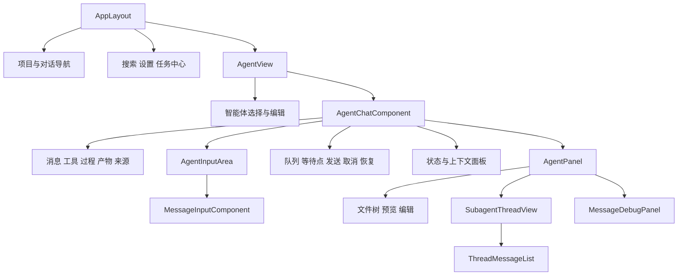
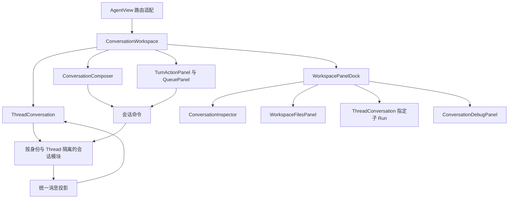

# 前端组件重构报告

状态：proposed
类型：architecture
Owner：frontend/src/views/AgentView.vue

调研日期：2026-09-30。读者为前端维护者、产品设计者和后续实现的 Reviewer。本文以 AgentView 的完整可见工作区为中心，提出整个前端的组织调整方案；所有目标组件、目录和契约均为提案，尚未实现。

结论：前端需要围绕业务边界进行系统重构。优先建立按 Thread 隔离的会话数据与订阅模块、仅传 `threadId` 即可工作的对话阅读组件，以及管理完整草稿与提交回执的统一输入组件。页面负责组合这些能力，文件、状态、子智能体、调试和管理功能分别拥有自己的数据与界面。Vue 3、Vite、Pinia 和现有设计 token 可以继续使用。

## 已确定的产品与工程约束

用户选择 `1A、2A、3A`，以下三项作为后续设计与实施的验收约束。架构仍为 proposed，约束确定不表示产品实现已经完成。

| 决策 | 已确定方案 | 验收影响 |
| --- | --- | --- |
| 功能范围 | 全部保留 AgentView 当前可见能力，重新组织并按需加载 | 状态与上下文压缩、文件编辑、子智能体详情、调试审计和快捷智能体编辑等均须保留；拆分组件不能删减功能 |
| 草稿恢复 | 刷新或重新打开浏览器后恢复文本、提及和已确认附件；未发送图片重新选择 | 按身份与 target 隔离草稿；附件重新读取服务端事实；未发送图片和未完成上传不纳入完整本地持久化，恢复时给出提示 |
| 类型体系 | 全前端最终统一 TypeScript strict，分阶段迁移 | 核心模块先迁移，其余模块在重构完成前收敛；核心使用 TS、其余长期保留业务 JS 不能作为完成状态 |

## 问题

### 调研范围与验收目标

本报告回答三个问题：AgentView 可见能力怎样划分职责；对话与输入组件怎样独立复用；其余前端模块怎样遵守相同的依赖、状态和测试规则。

| 范围 | 本报告的完成标准 |
| --- | --- |
| AgentView 及其布局 | 覆盖聊天、输入、侧栏导航、项目、搜索、设置、任务中心及快捷智能体编辑 |
| 消息与流式链路 | 追踪历史、Thread/Turn/Run、SSE、队列、等待点、终态与子智能体的真实实现 |
| 输入链路 | 明确文本、提及、图片、附件、运行配置、新建 Thread、发送、引导及拒绝恢复的归属 |
| 全局框架 | 给出目录、依赖、路由、状态、API、类型、样式、生命周期和测试的目标边界 |
| 可执行性 | 提供公开组件契约、保留与删除范围、实施顺序、负向案例与证据要求 |

本轮只生成报告，不修改产品实现、依赖、后端接口或数据；不创建 commit、PR 或部署。没有历史包袱按“允许删除内部旧接口、重复流程和无消费者兼容代码”理解，现有用户能力、权限、数据和后端运行语义继续作为验收约束。

### 证据范围

现状结论来自工作区源码静态读取，状态为 `Inspected`。工作区包含其他任务的未提交问答与事件路由改动；本文以读取时的文件为准，后续实施前必须复核。没有执行真实聊天、断网、审批或浏览器视觉验证，因此不宣称当前界面存在已复现的运行故障，也不宣称提案通过产品验收。

深读范围包括 AgentView、AgentChatComponent、三层输入组件、ThreadMessageList、SubagentThreadView、AgentPanel、会话相关 composable/store/API、消息投影、App/AppLayout/router，以及后端 History、Thread/Turn 快照和事件读取 Owner。其他页面以目录、入口和依赖抽样评估；全局组织建议不等于对每个页面逐行完成审计。

### 当前代码结构

现有关系如下。AppLayout 包含 AgentView 外围可见功能，AgentChatComponent 拥有主会话多数流程。



源码规模在读取时为：AgentView 377 行，AgentChatComponent 5,629 行，MessageInputComponent 1,731 行，AgentInputArea 489 行，AgentPanel 1,824 行，MessageDebugPanel 2,098 行，AppLayout 1,034 行。统计包含模板、脚本和样式，仅用于定位审阅压力；重构验收以职责和行为为准。

源码证据：[AgentView](https://github.com/xerrors/Yuxi/blob/main/frontend/src/views/AgentView.vue)、[AgentChatComponent](https://github.com/xerrors/Yuxi/blob/main/frontend/src/components/AgentChatComponent.vue)、[AppLayout](https://github.com/xerrors/Yuxi/blob/main/frontend/src/layouts/AppLayout.vue)。链接提供稳定定位，具体判断以工作区调研快照为准，远端 main 可能与快照不同。

### 影响维护性的具体问题

| 源码事实 | 维护影响与判断 |
| --- | --- |
| AgentView 通过组件 ref 调用 `selectThreadFromRoute`，子组件通过 `thread-change` 回写 URL，另有同步标志避免循环 | 路由与选中状态形成双向协调。建议 URL 拥有页面 Thread 身份，子组件直接消费 prop |
| `selectThreadFromRoute` 从 `threads` 寻找目标，不存在时重新加载列表；store 默认读取前 100 个非置顶项 | 深链接读取依赖侧栏分页。按此控制流，未进入已加载列表的 Thread 会被判不存在；实际页面表现未执行验证 |
| `currentThread` 从导航列表派生，AgentChatComponent 使用全局 `currentThreadId`、`selectedAgentId` 与全局消息 loading | 一个组件实例依赖全局选中上下文，难以同时展示两个 Thread，导航缓存与实体读取相互影响 |
| 历史、runs、attachments、流式 state、模型选择、配置提示、预览缓存分散在多个按 Thread 索引的对象里 | 同一业务归属需要维护多个更新和清理点，关系无法通过单一契约核对 |
| 主聊天与子智能体各自加载历史、维护增量、处理 SSE、重连、终态回读和滚动 | 实现已经出现两套会话阅读流程；ThreadMessageList 只是接收数组的展示组件，尚不满足仅传 threadId 的要求 |
| 主聊天自行渲染对话行，子智能体使用 ThreadMessageList，二者合并历史与增量的方式不同 | 相同消息的展示与去重规则存在多处修改点；应共享一个投影流程 |
| `useAgentRunStream` 通过大量回调访问外部 state，并按当前 Turn 过滤和在结束时停流 | 页面仍需编排读取、审批、队列和副作用；从命名与接口上也未完整表达 Thread 级观察 |
| MessageInputComponent 同时处理 contenteditable DOM、Selection/Range、提及检索、资源分组和提交按钮 | 编辑器、业务资源与发送策略缺少明确界面，光标问题和资源问题容易互相牵动 |
| 文本草稿在 Thread draft session，图片在 AgentInputArea 本地，附件在父组件；`handleSend` 发出事件后清空图片 | Vue 事件没有提交回执契约。创建失败或普通发送失败的恢复范围需要重新设计，不能靠父组件调用 `restoreImages` 补全 |
| `handleSendMessage` 生成请求 key、清空文本、构造乐观消息，并等待 `startRunStream` 整条流结束 | 输入接收与运行观察在一个异步流程中；网络结果不明、后续编辑和运行恢复的职责难以独立测试 |
| `handleSendMessage` 对 follow-up 与 steer 都传模型和审批策略；后端拒绝 steer 的非空配置覆盖 | 前后端契约在引导路径不一致；应按 mode 序列化，steer 继承当前运行配置。此为静态核对，尚未浏览器复现 |
| AgentPanel 接收预览缓存、多个选中态和轮询条件；父组件同时管理路径、标签、宽度和缓存释放 | 面板外观与文件工作区生命周期相互绑定，文件功能更改会扩散到聊天主组件 |
| 工具卡片通过字符串 `inject` 取得父页面方法；AgentMessageComponent 从 agent store 取知识库目录 | 叶子展示组件隐含宿主要求，独立嵌入时能力不完整或读到别的上下文 |
| App、router guard、AppLayout、AgentView、聊天组件均包含 agent 初始化入口；AppLayout 还加载其他域资源 | 启动 Owner 分散，进入一个页面会牵动多个领域；初始化中的调用也缺少统一的完成承诺 |
| 单测包含纯函数、Vue 运行时以及源码字符串断言；浏览器脚本由开发者在登录环境手动执行 | 已有有效证据值得保留，但字符串存在性无法证明 IME、焦点、粘贴、拖拽和真实订阅行为 |

源码证据：[chatThreads store](https://github.com/xerrors/Yuxi/blob/main/frontend/src/stores/chatThreads.js)、[ThreadMessageList](https://github.com/xerrors/Yuxi/blob/main/frontend/src/components/ThreadMessageList.vue)、[SubagentThreadView](https://github.com/xerrors/Yuxi/blob/main/frontend/src/components/SubagentThreadView.vue)、[输入包装](https://github.com/xerrors/Yuxi/blob/main/frontend/src/components/AgentInputArea.vue)、[编辑器](https://github.com/xerrors/Yuxi/blob/main/frontend/src/components/MessageInputComponent.vue)、[Thread SSE](https://github.com/xerrors/Yuxi/blob/main/frontend/src/composables/useAgentRunStream.js)、[agent store](https://github.com/xerrors/Yuxi/blob/main/frontend/src/stores/agent.js)。

### 可以保留的基础

仓库已经具有集中 API 封装、独立的消息转换与分组函数、滚动控制、流式平滑、图片限量、创建 single-flight、文件预览、安全 Markdown 处理、异步设置面板和子 Run 观察测试。主聊天和文件面板也已处理部分 KeepAlive 激活与停用，不能将现状描述成完全没有清理。

这些能力先按新 Owner 迁移并复核消费者。现有测试中的消息归属、父子隔离、队列恢复、图片顺序、审批过期、HTML 清洗与对象 URL 释放等结果约束继续使用。重构允许替换实现和测试装配方式，保留独立的业务 oracle。

相关 Owner：[消息转换](https://github.com/xerrors/Yuxi/blob/main/frontend/src/utils/messageProcessor.js)、[消息分组](https://github.com/xerrors/Yuxi/blob/main/frontend/src/utils/messageGrouping.js)、[滚动](https://github.com/xerrors/Yuxi/blob/main/frontend/src/utils/scrollController.js)、[Markdown 安全渲染](https://github.com/xerrors/Yuxi/blob/main/frontend/src/utils/markdown_preview.js)、[设置惰性装配](https://github.com/xerrors/Yuxi/blob/main/frontend/src/components/SettingsModal.vue)。

## 提案

### 实现方案

以 `conversation` 业务模块拥有 Thread 阅读、Input 提交和等待点响应，以 `workspace` 拥有文件操作与预览，以 `agents` 拥有智能体目录和编辑，以应用层拥有路由、导航和工作区组合。会话内部只设数据会话、命令、投影和 UI 四类边界；每个文件对应实际消费者，避免按技术名词建立大量空层。

现有 Thread 入口的主链路调整为：URL → ThreadConversation 的 `threadId` → 会话模块直接读取授权快照 → 建立 Thread 事件订阅 → 统一投影 → 消息列表。输入主链路为：ConversationComposer 的明确 target → 草稿快照 → 必要时创建 Thread → 提交 Input → 用持久回执确认接收 → 会话模块观察后续执行。面板从工作区取得自己的 target，只读取所需切片；面板网络失败不会中断输入或消息订阅。

### AgentView 可见能力的归属

| 用户能力 | 目标 Owner | 与主会话的关系 |
| --- | --- | --- |
| 项目分组、对话分页、搜索、重命名、置顶、归档、未读提示 | 应用导航组合 + conversation/projects 数据模块 | 导航改变 URL，读取组件不依赖列表是否含有目标 |
| 对话标题、加载、空态、错误、断线提示、生成状态 | ThreadConversation | 由该 Thread 的数据与连接状态决定 |
| 用户消息、回答、推理、工具过程、来源、复制、图片、附件、产物卡片 | 会话投影 + timeline 展示组件 | 共享一个展示模型，操作输出明确意图 |
| 文本、提及、图片、附件、粘贴、拖拽 | ConversationComposer + composer editor | 归属同一个草稿，传输格式在 API 边界转换 |
| Agent、Project、模型与工具审批策略选择 | Composer 的上下文区 + 对应目录模块 | 新 Thread 可选 Agent/Project；已有 Thread 使用持久绑定，配置按 Input 接收冻结 |
| 普通发送、运行中排队、引导、停止、取消排队、继续队列 | 会话命令 + Composer/QueuePanel | 显式命令，前端只投影服务端 FIFO |
| 回答问题、工具批准或拒绝 | TurnActionPanel + 会话命令 | 独立核心区域，绑定 turn/run/waitpoint；普通输入可编辑但不能提交 |
| 上下文占用、压缩、待办、附件摘要、产物摘要 | ConversationInspector | 状态摘要按需读取，压缩通过会话命令执行 |
| 子智能体状态、打开指定子 Run 对话 | 子 Run 观察模块 + ThreadConversation | 共享传输和投影基础，Run 过滤作为查看范围 |
| 对话目录、个人空间、文件检索、预览、编辑、下载、删除 | WorkspaceFilesPanel + 文件模块 | 使用明确 scope，拥有标签、缓存、错误和生命周期 |
| 消息审计、运行时序与 Debug | ConversationDebugPanel | 超级管理员入口和独立审计 API，按需装配 |
| 新建或编辑智能体、运行配置、共享配置 | agents 模块 | 快捷入口打开同一编辑功能，聊天只刷新有关目录与配置 |
| 账号、API Key、基础/OCR/用户/部门/环境配置、主题 | settings/identity/system 模块 + 全局 overlay | 按权限与实际打开的设置项加载 |
| 后台任务中心、应用导航、品牌与外部项目入口 | tasks 模块与应用 shell | 具有应用级生命周期，聊天不拥有其初始化 |

“非核心”表示可以从会话执行主链路中拆出，不表示删除用户功能。等待点和队列控制属于核心业务，独立组件仍与会话事实同步。文件操作、智能体编辑和调试可按需打开，摘要数据保持轻量。

### 目标组件关系

下图仅描述提案。ThreadConversation 可以单独嵌入，ConversationWorkspace 是 AgentView 使用的组合界面。



AgentView 只负责将 route 参数与新建上下文传给 ConversationWorkspace，以及在新 Thread 创建后导航。页内高级能力的装配属于 workspace，避免将原 5,629 行原样搬进另一个总控组件。组合层不写 SSE parser、消息合并、上传实现或文件缓存算法。

### 自洽的 Thread 对话组件

建议公开组件命名 `ThreadConversation`。最小用法如下，调用方提供 Thread 身份，组件完成授权读取、历史展示、流式更新、重连、错误提示和滚动。登录与 HTTP 客户端由应用提供，调用方无需先选择 Agent、初始化侧栏或传入消息数组。

```vue
<ThreadConversation :thread-id="threadId" />
```

| 公开契约 | 建议语义 |
| --- | --- |
| `threadId`，必需 | 现有 Thread 身份；为空时显示无目标状态，不创建 Thread |
| `runId`，可选 | 精确查看该 Thread 内指定 Run；用于已有子智能体详情，不推断相邻 Run |
| `active`，默认 true | 可见性提示；与组件激活、停用和页面可见性共同决定观察需求 |
| `open-resource` 事件 | 携带规范化资源引用，宿主可在文件面板打开；组件本身提供基本查看入口 |

组件默认只读。独立阅读可以显示“正在运行”“等待回答”“失败”和暂停摘要，回答或审批由 TurnActionPanel 提供。它不会因为挂载就创建消息、取消任务或标记已读；是否记录已读由用户实际查看的工作区负责。复制、展开、查看来源属于阅读行为。

文件、引用和产物的基本查看入口由 conversation 的轻量资源预览组合提供。宿主接管 `open-resource` 时使用工作区面板。资源加载依旧通过对应领域 API；ThreadConversation 的独立使用不得隐含要求父组件提供文件面板或字符串注入方法。

内部区分三项职责：`useThreadSession` 提供会话数据和观察生命周期，`projectConversation` 将持久快照与增量转成一致行模型，`ConversationTimeline` 渲染行模型并管理本实例的滚动、展开和选择。展示叶子组件接收完整展示数据，不从全局“选中 Agent”获取来源名称。这里的自洽体现在公开使用闭合；内部共享数据模块仍可独立测试和复用。[Vue composable 文档](https://vuejs.org/guide/reusability/composables.html)支持封装有状态逻辑，也明确普通 composable 调用会创建独立状态，因此共享会话需要显式的共享 Owner。

#### 会话数据与观察生命周期

建议 conversation 模块用一个 Pinia store 保存按身份作用域和 `threadId` 分桶的服务端投影。`useThreadSession` 负责为 UI 获取和释放观察需求；AbortController、重连 timer 和订阅消费者放在运行时管理对象，业务快照保持可序列化。相同身份下 Timeline、Composer、Inspector 访问同一个 Thread 时共享一份实体数据和至多一条 Thread SSE。

| 状态种类 | Owner | 规则 |
| --- | --- | --- |
| Thread、Input、Turn、Run、Message、waitpoint、queue | 后端持久事实；前端会话 store 保存投影 | 不能将本地 busy、断线或按钮点击当作业务终态 |
| 连接状态 | 会话观察模块 | `connecting/live/reconnecting/offline/error` 与 Turn 状态分开 |
| 待确认提交 | 会话命令 | 按请求 key 保存冻结载荷和结果，不计为已执行 Run |
| 草稿与上传 | Composer draft | 按身份和 draft target 隔离，提交只消费确认接收的版本 |
| 滚动、消息展开、图片预览开关 | Timeline 实例 | 两个阅读实例有独立视口，互不抢焦点或滚动 |
| 面板标签、宽度、最大化 | WorkspacePanelDock | 不进入业务 Thread 状态 |
| Agent/Project/工具等目录 | 各领域目录 store | 实体缓存与编辑表单分别保存 |

Thread 切换、用户退出、组件卸载、KeepAlive 停用和隐藏标签页都需要显式处理。最后一个可见消费者释放观察需求时关闭流与观察轮询，保留该登录会话内的快照；重新可见先回读再继续订阅。关闭 UI 观察不会取消后端执行。会话缓存不持久化到 localStorage；无消费者的桶允许释放，禁止随浏览历史无界积累。[Vue KeepAlive 文档](https://vuejs.org/guide/built-ins/keep-alive.html)将停用与卸载区分开，二者需覆盖各自的资源释放。

身份切换先终止旧 scope 的网络工作并清空业务缓存。每次加载记录捕获的 scope、Thread 和请求版本，旧响应不得写入新 scope。相同 Thread 双查看器去重与身份隔离必须通过行为测试证明。这里采用小型消费者计数来服务已有 Timeline/Composer/面板复用需求，不扩展成跨标签页连接 broker。

#### 历史与流式统一投影

投影保留后端明确的 Thread/Turn/Input/Run 关系：按 Turn 展示一轮工作，按 Run 展示其中执行过程，用持久 Message 身份或协议明确来源身份对账。排队 Input 即使尚无 Run 也有自己的消息与投递状态；普通输入不依赖空白 Run 占位。显示进度时区分接收中、已排队、执行中、等待用户和业务终态。

将主聊天与 ThreadMessageList 的重复渲染统一到 `ConversationTimeline`。推荐行模型只覆盖现有消费者：用户消息、回答、执行过程组、产物、配置提示和状态提示。工具结果使用 `(runId, toolCallId)` 关联。父流携带的子运行身份属于事件来源，子消息写入子 Thread 桶；根 Turn 的状态只能由对应根关系更新。

Turn 的最终回答必须来自 `result_run_id` 指向 Run 的 `output_message_id`。不能用“最后一条 AI 消息”或最后一个 Run 作为最终结果。现有 History 返回 `thread/runs/history`，其中 runs 只含有限字段，历史所有 Turn 的完整结果映射尚不包含在同一响应中。这是提案的接口约束，实施时先使用现有精确 Turn 读取验证；若按 Turn 查询造成批量开销，再单独提出 History 增加紧凑 Turn 结果映射的后端变更。

指定子 Run 的阅读使用 `getAgentRun(childThreadId, runId)` 返回的该 Run `status/output_message_id/output`。子 Run 的 turnId 属于根 Thread，子 Thread 自己不拥有该 Turn；不能用 `getThreadTurn(childThreadId, rootTurnId)` 读取，也不能依赖 child 的 current_turn 恢复观察。子 Run 已完成而根 Turn 仍在运行时，子详情独立回读并收尾；同根 Turn 的其他子 Run 不能替代指定 Run 输出。统一会话模块共享传输、归属和展示基础，顶层 Turn 与子 Run 的恢复/终态策略保持明确分支。[Run 快照服务](https://github.com/xerrors/Yuxi/blob/main/backend/yuxi/modules/agents/services/runs.py)拥有此读取契约。

相关事实 Owner：[History 投影](https://github.com/xerrors/Yuxi/blob/main/backend/yuxi/modules/agents/services/messages.py)、[Thread 快照](https://github.com/xerrors/Yuxi/blob/main/backend/yuxi/modules/agents/services/threads.py)、[Turn 结果与等待点](https://github.com/xerrors/Yuxi/blob/main/backend/yuxi/modules/agents/services/turns.py)。普通用户可见 History 与受限 Model/Tool audits 继续分离，调试模型中间消息不能成为普通历史的备用数据源。

SSE transport 只负责鉴权、字节解码、事件边界、取消和协议错误，前端业务 reducer 负责归属与更新。Thread 观察覆盖后继 Turn 和队列领取，不随一个 Run 或 Turn 结束就永久停止观察。Run 过滤只改变阅读范围，共享传输仍按 Thread 管理。未消费的事件不通过叶子组件决定 Thread 归属。

Thread cursor 是后端拥有的复合游标，客户端保存原值并通过 Last-Event-ID 传回；Redis Run stream sequence 与 Thread cursor 不能混用。游标过期或 `agent.thread.resync` 触发回读持久状态，恢复成功后再更新连接提示。损坏事件显示可观察的协议错误并尝试快照恢复，禁止把解析异常包装成业务完成。[SSE 协议说明](https://developer.mozilla.org/en-US/docs/Web/API/Server-sent_events/Using_server-sent_events)支持事件 id 与多行 data，项目 cursor 结构以[后端事件服务](https://github.com/xerrors/Yuxi/blob/main/backend/yuxi/modules/agents/services/events.py)为准。

历史读取与订阅之间的竞态是单独的验收项。当前 History 没有提供与自身读取原子对应的恢复 cursor，不能直接宣称“取历史再开流”无遗漏。先验证订阅后缓冲、回读、按明确来源去重及终态再回读的组合；若协议无法证明重放增量的身份和顺序，需由事件服务提供快照与恢复位置契约。后端契约未闭合前，不验收为可靠流式重构。

流式平滑只影响展示节奏。持久终态回读成功后，以持久结果替换对应增量；回读失败时保留已展示内容并标记同步失败，不能清空成成功空态。长历史先按 Turn 折叠过程、限制重复投影与 Markdown 重渲染，再用测量决定是否引入虚拟列表或历史分页。后两项分别影响 DOM 与后端读接口，不能凭文件规模提前增加依赖。[Vue 性能指南](https://vuejs.org/guide/best-practices/performance.html)提供稳定 props、代码拆分和大列表虚拟化的依据，具体采用以本项目测量为准。

### 统一输入组件

建议将产品级输入命名为 `ConversationComposer`，将纯编辑表面命名为 `ComposerEditor`。前者自洽地管理完整草稿、上传、上下文选择、命令可用性与提交回执；后者负责文字、提及节点、光标、键盘、IME、粘贴和拖拽事件。Agent/Project/模型目录和附件传输由对应数据模块提供，页面不再自行拼接输入内容。

最小用法区分已有 Thread 和新建草稿。以下对象是组件契约草案，字段名在类型实施阶段定稿。

```vue
<ConversationComposer :target="{ kind: 'thread', threadId }" />

<ConversationComposer
  :target="{ kind: 'draft', draftId, agentId, projectId }"
  @thread-created="navigateToThread"
/>
```

已有 Thread target 从持久快照取得 Agent/Project 绑定，组件可以独立工作，无需父组件设置全局 selectedAgentId。draft target 使用稳定 draftId；打开两个新建入口有不同草稿，不能统一写入全局 `__draft__`。`thread-created` 用于宿主导航，`accepted` 用于提示或分析接收结果，它们只报告结果，不替代组件内部 await 的命令回执。

“全能”覆盖当前产品支持的文字、资源提及、多图、附件、模型与审批策略、普通输入和 steer。问题回答与工具批准保留独立 TurnActionPanel，因为其目标是消费固定等待点，数据不是一条普通输入；不能用十余个 boolean 将完全不同的提交语义塞进同一个编辑器。

#### 一个完整草稿

| 草稿内容 | 建议保存形式 | 持久化规则 |
| --- | --- | --- |
| 文本与提及 | 文本段和结构化提及节点，具有明确 resource kind/id/label | 本地保存按用户 scope 与 target 隔离；API 边界序列化为现有提及 token |
| 多模态图片 | 稳定 localId、原选择顺序、uploading/ready/failed、内存载荷 | 不把 base64 与 Blob URL 写入 localStorage，刷新后说明需重新选图 |
| 解析附件 | 临时上传记录、解析状态、确认后 fileId、所属 Thread 与 Input | 引用服务端附件事实；传输、解析、确认分别显示状态 |
| 执行选择 | 下一次提交的模型、审批策略；draft 的 Agent/Project | 接收时冻结，后续配置变更影响下一 Input |
| 提交记录 | 草稿 revision、请求 key、冻结载荷、接收或结果不明状态 | 与用户正在编辑的新草稿分离，完成确认后再消费对应内容 |

编辑器内部统一由草稿模型派生 DOM，DOM Selection 只表达编辑操作和选区。提及候选由 `useMentionSuggestions` 读取当前 target 的资源，弹出列表负责键盘导航和选择。异步检索捕获 query 和 target 版本，旧返回不能覆盖新候选；资源 label 是展示信息，后端继续拥有授权。

保留现有提及 token 的 wire 契约，可以删除编辑器内部的兼容分支。提及原子删除、跨节点选区、剪贴板纯文本、撤销重做、中英文 IME 和粘贴危险 HTML 是选择实现的验收输入。先将现有 contenteditable 与 token 转换收敛到单一编辑模型，用浏览器行为测试检验；只有其复杂度或功能缺陷无法收敛时，再评估成熟编辑器依赖。富文本编辑器的更换需要独立取舍，不能把新依赖当作重构前提。

现有 AiTextarea 用于描述生成/润色，是业务表单控件，保留其专门用途；它不纳入对话输入合并，避免将普通管理表单也绑定聊天生命周期。

#### 输入接收与运行执行分离

提交命令返回三类显式结果：`accepted` 表示有持久 Input 回执，`rejected` 表示已知拒绝，`unknown` 表示请求发出但无法确认是否接收。命令在接收回执后完成，SSE 由会话观察继续运行。运行失败发生在 accepted 之后，作为对应 Input/Turn 结果展示，不能再次恢复成“未发送”的草稿。

一次提交的线性步骤如下。

1. 冻结草稿 revision、附件与 mode；follow-up 同时冻结模型和审批策略，steer 固定当前 turnId 并继承当前 Run 配置。生成并保存请求 key。上传未完成、必需上下文缺失或等待点阻止提交时给出具体原因。
2. draft target 需要创建 Thread 时，复用同一创建意图的幂等 key 和 single-flight；创建成功后把该草稿映射到真实 Thread。若附件确认已经需要 Thread，也走此流程。
3. 将冻结载荷转换为 Public Thread Input，follow-up 携带执行选项，steer 省略 model_spec 与 tool_approval_mode。两种 mode 共用文本、图片和附件转换，一次请求重试保持 key 和载荷相同。
4. accepted 时消费该 revision 的内容与附件绑定，保留提交期间新增的编辑和上传；由 Input 回执更新排队或已领取状态。
5. rejected 时保留对应草稿与图片，在输入区域展示错误。服务端已创建的 Thread 仍保持明确关联，附件确认失败可以独立重试。
6. unknown 时保留冻结提交，显示“接收结果待确认”，允许按原 key/载荷重新确认；禁止自动改 key 发第二条消息，也禁止把未知结果报告成已拒绝。

传输失败时是否提供按 key 查询，需要核对现有 Public API 的幂等回执能力。当前前端仅将 key 放在 Idempotency-Key header，尚没有完整的 unknown 恢复 UI。提案默认通过同 key、同载荷的幂等重提交确认，不凭空假设已存在查询 endpoint；必须用真实 HTTP 和持久 Input 数量验证。

提交期间允许用户继续编辑下一草稿。新 Thread 创建期间锁定 Agent/Project 绑定选择，发送与停止按钮的行为由冻结提交、当前草稿和服务端动作状态共同决定；拒绝结果不能用旧图片数组覆盖提交期间的新图片。已有 `restoreImages` 命令式补丁由版本化草稿消费取代。

#### 明确发送和运行控制

| 当前状态 | 主操作 | 其他操作与约束 |
| --- | --- | --- |
| 空闲且草稿可提交 | 发送 | 空草稿不提交；图片可形成有效输入 |
| 运行中且有新内容 | 加入队列 | 对当前 Turn 可 steer 时显示“引导”；复用同一草稿序列化，不能漏掉图片 |
| 运行中且无新内容 | 停止当前任务 | 以当前 Turn/Run 为目标发出取消，不删除排队输入 |
| 已接收但尚未领取 | 展示排队 | 可取消指定 Input；取消结果回读队列 |
| 等待问题或审批 | 展示 TurnActionPanel | 可以编辑后续草稿，普通提交不可用；回复绑定固定 waitpoint |
| failed/cancelled 后队列暂停 | 展示暂停与继续入口 | 只有显式继续命令恢复派发 |
| 上传未完成或接收结果不明 | 显示具体状态 | 不用单一 `isLoading` 同时表示上传、提交、运行和断网 |

工具审批策略与模型选择是后续 follow-up Input 的执行选项，steer 使用固定 Turn 当前 Run 的配置。智能体持久配置编辑属于 agents 表单。单次覆盖、Thread 默认与 Agent 默认的展示优先级集中定义为一处可测试函数，接收时的配置解析仍由后端拥有；历史消息展示其接受时的事实，不读取今天的编辑值改写过去。相关契约由[输入接收服务](https://github.com/xerrors/Yuxi/blob/main/backend/yuxi/modules/agents/services/inputs.py)拥有。

#### 输入交互与可访问性

保留 Enter 发送、Shift+Enter 换行、中英文组合输入不发送、上下键选择提及、Escape 关闭候选。菜单、提及列表、上传卡片、审批和移动端底部区域的焦点规则统一由各组件实现，overlay 关闭恢复到触发元素。选择模型或文件不丢编辑器选区。

loading、empty、error、上传部分失败、停止待确认、断线、只读和权限变化均有可见文案。屏幕阅读器使用低频状态摘要，避免逐 token 宣读；流式更新不抢夺浏览历史时的滚动位置。浅色/深色、窄屏、软键盘遮挡、长资源名和键盘操作作为同一验收矩阵。仓库[设计规范](../../design.md)继续拥有视觉与 token 规则。

### 非核心功能的组织

ConversationWorkspace 使用一个面板停靠区，负责宽度、响应式位置、标签与开关。面板选择用明确的联合类型表达，例如 file scope/resource、child thread/run、inspector thread、debug thread；各面板拥有数据读取和错误状态。面板组合只覆盖已有类型，不建设动态插件框架、事件总线或通用 panel engine。

| 功能模块 | 自己拥有的内容 | 从外部取得的最小上下文 |
| --- | --- | --- |
| WorkspaceFilesPanel | 对话目录与个人空间切换、树加载、搜索、文件操作、预览标签和缓存、Blob URL 释放 | 显式文件 scope，必要时 Thread/Project 身份 |
| ConversationInspector | token 用量、上下文构成、待办与资源摘要、刷新 UI | Thread 身份及会话只读切片，压缩动作委托会话命令 |
| 子智能体详情 | 指定 Run 的标题与元信息、共享 ThreadConversation 阅读器 | child threadId/runId，不从最后一个工具结果猜测目标 |
| ConversationDebugPanel | audits 请求、运行时序、截断提示、查询错误与筛选 | Thread 身份及必要只读运行摘要 |
| AgentEditorDialog | 配置草稿、表单校验、保存、共享范围和冲突反馈 | agentId 或新建模式，保存后使对应目录缓存失效 |
| 全局设置与任务中心 | 对应领域的数据、权限入口与 lifecycle | 登录身份和模块自己的 target |

当前文件预览与导航的大量状态从 AgentChatComponent 移回文件模块。预览缓存 key 包含身份、scope 和资源身份，删除、保存、切换 scope 时由 owning 文件模块失效；同名 `/foo` 在对话目录和个人空间中不能共用缓存。Viewer 相对路径、runtime 绝对路径和对象 URL 使用有区别的资源引用，宿主路径不进入前端契约。

文件功能复用 WorkspaceView 与聊天面板所需的文件浏览/预览基础，两个容器可以使用不同布局。资源预览通过明确的资源种类选择领域 API，不以任意 URL 作为通用文件身份。HTML/Markdown/PDF 的安全处理、沙盒 iframe 和 CMap 本地资源继续由相应现有边界执行；重构不放松这些约束。

隐藏或停用面板停止其轮询和昂贵解析；打开面板才加载其代码与数据。Inspector 需要的轻量状态摘要与运行时等待点读取分开，避免关闭状态面板时连核心审批也无法恢复。子 Run 状态观察服务现有运行进度展示，详细消息读取仅在详情可见时启用。现有子流数量预算保留为约束，统一传输去重后再测量，不为每个卡片开独立 SSE。

工具渲染继续使用显式静态 registry，未知工具显示安全的通用卡片。展示组件只接收规范化调用数据，资源与子线程点击通过有限的 typed action context 交给所在会话边界。该 context 由 ThreadConversation 自身提供，独立嵌入也闭合；替换页面私有的字符串 inject。昂贵且低频的 renderer 按需加载，渲染错误有局部错误态，不能拖垮整条消息列表。

### 全局目录与依赖规则

建议全前端采用按业务组织的模块目录，业务域中再按 UI、data、model 的实际需要分文件。下面是职责示意，只有迁移到的消费者需要时才创建文件。

```text
src/
  app/                       # 启动、router、身份生命周期、layouts
  pages/                     # 路由适配与页面组合
    agent/                   # AgentView、ConversationWorkspace、面板停靠组合
  modules/
    conversation/
      index.ts               # 对外组件与必要类型
      model/                 # 消息投影、草稿、输入与动作类型
      data/                  # Thread session、命令、订阅生命周期
      ui/                    # ThreadConversation、Composer、等待点、timeline
    agents/                  # 目录、详情、配置编辑
    projects/                # Project 数据与选择、项目导航
    workspace/               # 文件数据、预览、搜索、资源操作
    extensions/              # Skills、MCP、工具管理
    knowledge/               # 知识库、图谱、评估
    settings/                # 设置容器和各配置面板
    identity/                # 登录、账号、用户与部门
    tasks/                   # 后台任务与定时 Agent
    dashboard/               # 统计与审计组合
  apis/                      # 集中 HTTP/SSE 与领域 DTO 协议封装
  shared/
    ui/                      # 按钮、菜单、弹窗、头像、基础状态
    lib/                     # 无业务依赖的时间、剪贴板、安全渲染等
  assets/                    # 现有全局 token、静态资源
```

依赖方向为 `app/pages → modules 的公开入口 → apis/shared`。模块内部允许直接导入本模块；跨模块只使用公开入口，禁止反向导入页面或布局。全局 sidebar 与 ConversationWorkspace 位于应用组合层，可以协调 Projects、Conversation、Agents、Workspace，业务模块不借 sidebar 互相更新。

各域自己的 model/data/ui 位于一起，取代顶层 components/composables/utils/stores 中混合增长的业务文件。shared 只接收无业务状态和网络职责的复用能力；知识来源列表、模型选择、OCR 配置、Skill 编辑等即使多页面复用，也属于各自业务域。generic 的 common/shared 两套目录统一为 shared/ui。

API 继续集中在 `src/apis`，遵守现有仓库规则。将 agent_api 的智能体 CRUD、Thread/Input/Turn、图片和附件入口按领域协议拆分，HTTP/SSE 基础封装保持一个 Owner。业务模块提供用例命令和状态组合，API 层不再通过 UI store 决定当前选中 Thread，也不管理表单草稿。

公开入口只导出当前消费者需要的组件、命令和类型，不把所有内部文件重新导出成总 barrel。依赖边界先通过 import 规则和 Reviewer 检查，后续 lint 只为真实已出现的跨域错误加限制；不建设文件数量、行数或中央 claim ID gate。

### 路由与全局状态

URL 拥有页面选中的 Thread/Project/resource，导航列表 store 只保存列表、分页、搜索和摘要缓存。重构后的 ThreadConversation 始终直接读取目标，不依赖列表 upsert 才能工作；列表刷新、归档和项目删除通过明确动作更新导航，实体读取失败有独立错误页面。

Pinia 保存需要跨组件共享的实体投影、目录和应用偏好。组件实例保存滚动和展开，表单保存编辑草稿，运行时对象保存网络生命周期。agent store 的目录、全局偏好、智能体编辑草稿和会话执行覆盖拆成对应 Owner；读取历史 Thread 不改变新建草稿选择的 Agent。

App bootstrap 只装配 HTTP 客户端、身份、主题和基础品牌配置。router guard 只做登录与权限体验判断；进入无权路由时导航到可访问页面，不先加载智能体目录。Agent/知识库/工具目录由需要它的模块按需加载，相同进行中请求返回共享 Promise。AppLayout 自己所需的 Project/Thread 列表与任务摘要保留加载，业务初始化不扩散回 App。

用户退出与重新登录是 app 身份生命周期的一个清理点：停止全部旧 scope 订阅、清空业务缓存、取消在途请求、重置当前导航。草稿 key 包含用户身份，退出后不显示其他用户草稿；是否保留本用户文本草稿是明确产品策略，默认保留隔离后的文本和资源引用，删除 Blob/base64。当前 user store 只显式重置部分域，重构时必须对全部会话与文件缓存补齐隔离测试。

### 类型与 API 错误边界

全前端最终统一 TypeScript strict 是已确定的完成标准。迁移先覆盖协议 DTO、Thread session、草稿与命令结果，再覆盖 UI 与其余模块；各业务模块完成时退出业务 JS 混用。ThreadId/RunId/TurnId/WaitpointId、资源 scope、提交结果和事件类型通过明确类型区分，消费处无需反复探测 `id/run_id/meta/metadata` 等形状。第三方工具结果保持 unknown，在 owning renderer/parser 边界解析。

TypeScript 不取代运行时校验，也不执行授权。HTTP DTO 和 SSE event 在协议边界校验必要字段，内部使用已收敛类型；无需在每个 helper 重复 defensive fallback。由 wire DTO 到内部模型只转换一次，不能用类型断言掩盖后端缺字段。

增加独立 typecheck gate，并为 TS/SFC 调整 ESLint 和测试装配。当前 Vite build 与 JS lint 不等于类型检查；[Vue TypeScript 文档](https://vuejs.org/guide/typescript/overview.html)明确 Vite 只转译，SFC 类型检查使用 `vue-tsc`。依赖增加限定为此契约确需的开发工具，不在本轮安装。

基础 API 保留脱敏日志、统一鉴权和结构化业务错误。JSON 与 SSE 请求复用身份失效处理，401 由单一身份流程处理，403/404 为资源级错误；服务不可用不伪装 empty。业务模块决定局部恢复，展示层决定 inline error 或一次 toast。避免基础 API、store、页面重复报告同一错误，也避免普通错误提示泄露内部运行信息。

Dashboard 的跨用户审计继续使用其独立授权入口。可以复用只读消息展示基础，不能直接把他人 threadId 交给普通用户 Thread API 并假设相同权限；受限 audits 数据不得并入共享普通会话缓存。

### 样式与运行成本

保留 Ant Design Vue 作为基础控件，现有 CSS token 作为主题 Owner，LESS 用于组件样式。抽出重复的 composer shell、面板 chrome、状态和菜单外观；业务布局放在模块局部，不从一个巨型聊天组件的非 scoped 样式控制子页面。避免另建 Tailwind/新 UI 库与现有体系并存。

重构后的 DOM 查询使用组件 ref。当前主聊天按 `.chat-main` 全局选择滚动容器，双实例可能选择到其他视口；新 Timeline 的滚动、ResizeObserver 和键盘事件全部绑定当前实例。移动端面板通过工作区布局切换为抽屉，统一 focus、关闭和层级规则。

性能测量覆盖首屏 chunk、低频面板加载、长历史 DOM、stream reducer/Markdown 耗时、同一 Thread 的 SSE 数、隐藏态轮询与内存释放。代码拆分优先针对 Debug、文件预览和高级编辑等实际低频依赖。项目已有 Markdown cache、流式平滑与异步 settings，先复用和测量；数值阈值由基线测量定稿，报告不虚构响应速度或包体改善百分比。

### 测试体系调整

纯投影、序列化、草稿消费、消息归属和动作判断使用快速 unit。Vue 组件测试挂载实际公开组件，断言显示、事件结果和生命周期；优先沿用现有 Vue runtime 测试能力，补齐 DOM 装配，工具增加以实际不足为准。源码字符串测试只用于真正静态的约束，不能作为 IME 不误发、菜单键盘导航或图片不丢失的唯一证据。[Vue 测试指南](https://vuejs.org/guide/scaling-up/testing.html)将 unit、组件与 E2E 区分，用户行为依赖真实装配的层级。

浏览器测试分两类：受控 HTTP/SSE 场景证明断线、竞态和交互，真实 API/worker 场景证明接收、FIFO、等待恢复与最终结果。受控协议测试的 fixtures 显式审阅，不能由同一个前端投影自动生成 expected output。真实链路使用测试创建的资源与确定性运行装配，回读 Input/Turn/Run、文件和 DOM；不以 HTTP 200、按钮 loading 消失或 mock 调用次数作为完成事实。

浏览器脚本收敛成可重复的测试入口，环境地址由运行槽位提供，避免脚本写死 localhost:5173。测试账号和资源由 fixture 管理，清理只针对本次资源。当前手工脚本继续作为参考，前端行为 gate 不能依赖预先登录、已有 Agent 或真实模型费用。新组件在正式重构前就具备独立验证入口，先证明可复用，再替换 AgentView。

### 实施顺序与退出条件

本表是后续实施建议，各阶段有可以审查和拒绝的结果。用户明确要求本轮停留在调研，所有阶段均尚未实施。分阶段用于验证职责与语义，最终删除旧框架表面，不长期维护两套聊天流程。

| 阶段 | 交付内容 | 验证方式与退出条件 |
| --- | --- | --- |
| 1 契约与证据基线 | 收敛 DTO/事件/草稿类型，确认 History 结果映射与恢复位置，记录现有 DOM 与运行语义 | 最小 unit、真实协议样本及相关 integration；结果与 cursor 约束尚有缺口时先解决 Owner 契约 |
| 2 会话读取核心 | Thread session、统一投影、ThreadConversation 独立挂载，主/子运行范围共享基础 | 两个不同 Thread 和同 Thread 双实例、重放/resync/终态回读、隐藏释放；组件无需侧栏初始化 |
| 3 输入与控制 | ConversationComposer、完整草稿、回执结果、TurnActionPanel 和 QueuePanel | IME/图片/附件/提交期间编辑、超时同 key 确认、FIFO/steer/审批的真实链路 |
| 4 Agent 工作区 | AgentView 改为路由组合，接入新会话和输入，移出面板功能 | 深链接、前进后退、新建/附件提前创建、双实例不串状态、浅深色与窄屏；移除主聊天重复流程 |
| 5 全局业务模块 | AppLayout、启动 Owner、目录/表单拆分、文件/设置/扩展/知识/任务/统计迁移 | 各域最小 lint/unit/build + 风险对应浏览器；共享基础不得反向依赖页面 |
| 6 清理与交付 | 删除旧组件、旧状态、无消费者兼容分支与旧测试装配，补齐 owning 文档 | import 和运行入口核对、完整 frontend gate、必要真实 E2E、独立 Review；所有现有能力有明确去向 |

第一份实现应优先交付 ThreadConversation 与会话模块，消费场景为 AgentView 和指定子 Run 详情。输入、面板和全局组织随后围绕同一事实 Owner 收敛。全前端重构的完成范围包括上述全部业务域，其他页面须在迁移前深读其 Owner；本报告不以 AgentView 瘦身作为整个前端完成的替代验收。

公开 API、用户数据、权限和路径隔离继续使用当前契约。内部组件接口可直接替换，无消费者的旧接口删除。若证据表明需要新的后端阅读投影或恢复契约，将其作为独立的小型前置变更审查，保留 service/repository 归属，不在前端引入猜测式兼容。

### 保留与删除范围

| 处理 | 范围与理由 |
| --- | --- |
| 保留并重新安置 | Vue/Vite/Pinia、Ant Design/LESS/token、鉴权和安全日志、API 集中边界、Markdown/PDF 安全、消息/滚动/图片等有业务测试的基础 |
| 重写职责与接口 | AgentChatComponent、主/子阅读流程、三层输入责任、agent 与 chat store、路由同步、面板状态、错误展示 |
| 删除旧表面 | 命令式 `selectThreadFromRoute` 与 route 双向锁、列表决定可读取性、全局当前 Thread 的组件依赖、父页面私有 inject、图片 `restoreImages`、重复的 SSE/历史投影流程、无消费者暴露与兼容分支 |
| 深读后迁移 | 知识库/图谱/评估、扩展管理、任务/定时 Agent、身份设置与 Dashboard；使用统一模块规则，保留各自真实领域语义 |
| 有证据后再引入 | 编辑器依赖、虚拟列表、History 分页/批量 Turn 映射、协议快照 cursor；有明确问题和消费者才增加 |

全能输入、自洽阅读和模块结构是三项需要一起闭合的目标。仅抽模板会留下旧编排，单一巨型 composable 会留下旧耦合，机械移动文件也不会产生可维护的业务边界。

## 替代方案

| 真实候选 | 收益 | 代价与建议 |
| --- | --- | --- |
| 在现有目录内抽出状态面板、文件面板和输入控件 | 变更量小，短期易验收 | 可作为局部工作，但无法解决全局选中、重复阅读与草稿回执，不能满足本次完整重构 |
| 保留 Vue 生态，按业务模块重建会话、输入、面板与全局装配 | 直接处理现有 Owner 缺口，保留有效基础与测试 | 推荐；接受内部接口全面替换与 TS/行为测试建设成本 |
| 重建为 React/另一套 UI 或大型前端架构框架 | 可以获得不同团队生态 | 没有源码证据说明现有问题来自 Vue；大量重写基础不自动改善状态归属，暂不选择 |
| 为输入、工具和面板建设通用插件系统 | 可支持独立第三方运行时扩展 | 当前 renderer/面板类型有限，无实际第三方装配需求；增加注册、版本、授权和生命周期维护面，不选择 |
| 增加通用服务端数据缓存库来替代 Pinia | 有成熟请求缓存与失效能力 | Thread 流、Input、waitpoint 与执行结果仍需领域 Owner；先收敛领域会话，跨域请求缓存出现重复需求时再裁决 |

## 后果

组件公开用法更小，但内部事实契约更明确；维护者需要按业务关系定位状态，而不是修改一个页面中的任意对象。Thread session 的共享生命周期带来消费者管理，换来当前已有主会话、输入与侧面查看器的统一数据和连接；保留其有限范围可以控制复杂度。

TypeScript、组件行为测试和确定性浏览器链路需要一次建设投入。重构允许删除旧内部兼容，不能删除持久用户能力或用量/审计等领域语义。新接口定稿后需要同步 ARCHITECTURE 和前端指南；本文保持 proposed，不能作为当前代码已经调整的事实来源。

## 验收标准

下表是提案验收证据，不构成独立中央主张清单。语义 Owner 指向实施后的 owning 模块；事实数据的 Owner 仍是后端。`Not run` 表示新架构没有实现。

| 验收主张 | 失败面 | 语义 Owner | 直接证据 / 命令 | 负向案例 | 当前结果 |
| --- | --- | --- | --- | --- | --- |
| 仅传 threadId 可读取与实时观察 | 依赖 Agent/侧栏初始化，深链接失败 | ThreadConversation / session | 独立组件挂载 + 真实 Thread HTTP/SSE | 目标不在前 100 个列表项，侧栏未挂载 | Not run |
| 多实例共享数据且视口隔离 | SSE 重复、A 消息写入 B、滚动串实例 | session / Timeline | 双实例 DOM、网络连接与释放结果 | A/B 响应乱序；同 Thread 第二个实例关闭 | Not run |
| 重放和历史交接不重复、不漏结果 | 快照/流竞态、过期 cursor、恢复成空 | transport / reducer / 后端 events | 协议 fixture + 真实重连与持久结果 | 取快照时完成 Run、事件重复、Redis 增量过期 | Not run |
| 最终结果归属明确 | 相邻 Run、子 Run 或模型审计替代顶层结果 | projection / 后端 turns | 持久 result_run/output_message 与 DOM 对照 | 同 Turn 存在旧 Run 和子 Run 的更晚输出 | Not run |
| 指定子 Run 独立展示自己的结果 | 对 child 查询根 Turn 404、等待根任务才收尾、误取别的子结果 | session / 后端 runs | child Run HTTP + worker E2E，指定 output 与 DOM 核对 | 子 Run completed 而根 Turn running，同根 Turn 多子 Run | Not run |
| 完整草稿按接收结果消费 | 图片丢失、新编辑被旧拒绝覆盖 | Composer draft / commands | 图片/文本 DOM 与持久 Input 核对 | Thread 创建失败、拒绝、提交期间加图与输入 | Not run |
| 刷新后按已确定范围恢复草稿 | 文本与提及丢失、附件引用越权、图片被静默遗漏 | Composer draft / workspace | 刷新与重新打开浏览器的 DOM、附件 HTTP 和存储核对 | 未发送图片、在途上传、附件已删除或无权访问 | Not run |
| 未知结果重确认不重复发送 | POST 成功但响应丢失后创建新 Input | commands / 后端 receipts | 真实 HTTP + PostgreSQL Input 数量 | 丢弃成功响应，用同 key 确认；变载荷需拒绝 | Not run |
| follow-up、steer 与停止保持各自语义 | UI 自动并发派发、带图发送误停止、steer 违规覆盖配置 | commands / inputs / scheduler | API/worker E2E、queue/Turn/Run 和 DOM | 排队两条、含图 steer、steer 配置覆盖返回 422、取消后队列暂停 | Not run |
| 等待点响应固定到对应运行 | 旧审批恢复新 Run，等待中普通消息被接受 | TurnActionPanel / 后端 turns | HTTP/E2E，回读 waitpoint 与新 Run 关系 | 页面切换后提交过期 waitpoint，普通输入尝试 | Not run |
| 隐藏释放观察，重新打开恢复 | KeepAlive/隐藏面板继续轮询、丢 cursor | session / 各面板 | 浏览器网络、timer 与恢复 DOM | 路由离开、Tab 停用、最后一个消费者释放 | Not run |
| 身份与资源 scope 隔离 | 退出后草稿/缓存串用户，同名路径串预览 | app identity / draft / workspace | 登录切换 DOM、缓存和授权 HTTP | A 的迟到响应到达 B；两个 scope 的 `/foo` | Not run |
| 非核心功能错误局部化 | 预览/审计失败阻断聊天与输入 | panel owners | 浏览器面板故障与核心链路继续工作 | audits 403、预览失败、动态组件加载失败 | Not run |
| 输入交互与主题可用 | IME 误发、键盘失焦、流式抢滚动 | Editor / Timeline / overlays | 真实浏览器 IME、键盘、浅深色与窄屏 | 组合输入 Enter、提及删除、粘贴危险 HTML | Not run |
| 全局框架实现预期依赖 | 初始化重复、业务反向依赖页面、JS 类型缺口 | app / modules / apis | lint、typecheck、unit、build、import Review | 不兼容 DTO、权限拒绝时触发目录初始化 | Not run |

未来实施至少执行仓库[测试规范](../../testing-guidelines.md)所要求的 frontend lint/unit/build；核心接收、FIFO、SSE、审批与文件范围补真实 E2E。TS 阶段新增 typecheck 命令后纳入 CI。语义变更与新 guard 的负向案例由相应 Owner 测试证明，完整 diff 必须经过独立 Reviewer。

## 风险

- History 的紧凑 Turn 结果映射和快照/SSE 交接契约尚待闭合，可能需要小型后端阅读接口变更；不能在前端静默猜测。
- 共享 Thread 观察若释放过早，会影响其他可见消费者；若释放不足，会积累流与 timer。双实例、KeepAlive 和登录切换是必须通过的负向场景。
- 输入模型重写涉及 IME、光标、撤销、图片和附件副作用。现有 token 协议、上传确认和 request key 的行为基线需要保留。
- 按业务搬迁容易把旧巨型逻辑换目录继续保留；Review 需要核对新 Owner 是否独占职责、重复流程是否删除，而非只看文件大小。
- Dashboard 跨用户数据、Debug audits 和普通对话具有不同读取权限；复用展示不得扩大数据获取或缓存范围。
- 工作区其他任务正在修改相关源码；实现前重新读取事实与测试，避免将调研快照当成永久约束。

## 验证

现状源码与 API Owner 核对：`Inspected`。下列命令实际执行，已有前端单测仅核对相关现状语义，不代表新架构已验收。

| 检查 / 命令 | 实际结果 |
| --- | --- |
| `wc -l` 核对主要组件规模；符号搜索与源码读取 | Inspected，报告中的控制流与接口判断已对照源码 |
| Python pathlib 检查本文 Markdown 相对链接、末尾换行与行尾空格 | Passed，2 个相对链接均存在，文件格式检查成功 |
| `cd docs && pnpm run build` | Failed，首次构建通过并有 chunk 超过 500 kB 警告；最终复核因其他任务修改的 implemented/2026-09-18-question-dialog-free-text.md 链接到同目录不存在的 builtin-tool-question-contract 而失败，本文相对链接检查通过 |
| `python3 -m unittest scripts.test_verify_engineering_contracts` | Passed，64 项测试通过 |
| `docker compose exec -T frontend node --test test/unit/messageProcessor.test.js test/unit/agentInputQueue.test.js test/unit/agentThreadQueueTransition.test.js test/unit/subagentThreadLifecycle.test.js` | Passed，31 项测试通过；并发启动 Vite 测试服务出现 24678 端口占用警告，退出码为 0 |
| `python3 scripts/verify_engineering_contracts.py` | Failed，最终复核有 4 项错误，均为其他工作区改动 builtin-tool-question-contract 提案的结果状态格式错误；本文未被报告错误 |
| `git diff --check` | Passed，执行时已存在的工作区 diff 无空白错误；新增本文另以 Python 核对 |
| 不继承开发上下文的独立 Reviewer 静态核对 | Inspected，steer 配置继承与子 Run 结果契约已修正并复核，无剩余阻断项；审查不替代运行验证 |

前端全量 lint/unit/build、后端 unit/integration/E2E 与真实浏览器链路：`Not run`。本轮仅新增提案文档，不提交产品代码，选择了相关现状 unit 与文档 gate；没有执行真实聊天、审批、断网、身份切换或视觉截图。其他任务的 gate 错误保持由其 Owner 处理，未修改这些文件。全仓文档最终构建未通过，首次构建通过也不证明产品语义，新架构所有验收项仍为 `Not run`。
