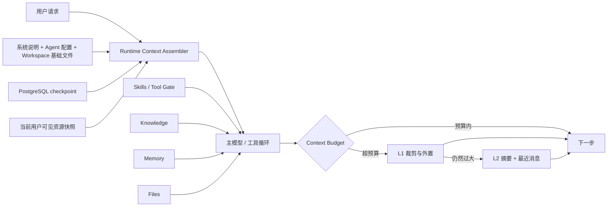

# 上下文工程：只加载当前步骤需要的内容

Yuxi 在每次 AgentRun 开始时组装一份受当前用户、Agent 配置和 Project 约束的运行上下文。系统保留小规模控制信息，把知识正文、文件内容、完整 Skill 说明和跨线程历史留在外部，由模型在任务需要时读取。本页负责常驻与按需加载的边界；压缩状态、阈值和恢复语义由[上下文压缩](./context-compression.md)负责。

## 整体链路

Runtime Context Assembler 只接受服务端重新读取的身份、配置和资源范围。浏览器提交的选择不能扩大当前用户的 Knowledge、Skills、MCP、Tools、Memory 或文件权限。Run Manifest 固化本次执行采用的稳定配置摘要；retry 遇到配置指纹漂移时拒绝继续。

## 常驻控制信息

主模型每次调用都需要一组可以解释当前身份、目标和执行边界的基础内容：

- 平台系统说明、日期、工作目录规则和 Agent system prompt；
- 用户工作区中的 `agents/AGENTS.md` 与 `agents/USER.md` 有界前缀；
- 当前 checkpoint 的有效消息视图；
- 当前已经开放的工具 schema；
- Agent 选择的 Skill 名称、说明和路径；
- 预加载 Skill 的完整根说明；
- Memory 开启且文件非空时的有界前缀，仅用于主 Agent。

这些内容构成控制面。它们需要足够稳定，规模也要受到限制。完整资料、长工具结果和大量能力 schema 持续常驻会增加每次模型调用的 token、延迟和费用。

## 按需加载的数据面

Knowledge、Memory、Skills 和 Files 采用不同入口，但遵循同一原则：先让模型知道能力存在，任务触发后再读取正文。

| 内容 | 运行开始时进入什么 | 任务需要时读取什么 |
| --- | --- | --- |
| Knowledge | 当前用户可见范围与 Agent 选择形成的知识库快照 | 检索结果、文档窗口和来源 Chunk |
| Skills | 名称、说明和 `SKILL.md` 路径 | 完整 Skill 说明、references、scripts、assets，以及激活后的依赖工具和 MCP schema |
| Files | 附件文件名和当前 Workdir 路径 | `read_file` 返回的文件内容 |
| Memory | 开关开启时的有界 `MEMORY.md` 前缀 | 当前用户可见历史的搜索和分段读取结果 |
| Tool results | 当前工具返回的短结果或预览 | Workdir 中外置的大结果文件 |

普通 Skill 在模型读取根级 `SKILL.md` 后进入激活状态，依赖工具和 MCP 才对后续模型请求可见。`preload_skills` 适合首轮必须使用的少量能力；它减少一次发现回合，同时增加每次调用携带的说明和工具 schema。

附件字节不会自动放入 Prompt。系统只把文件名和运行时路径加入本轮消息，模型通过文件工具读取需要的部分。Knowledge 文档正文也通过检索和打开文档工具进入上下文。

## 压缩与成本的权衡

上下文超过预算时，压缩中间件先减少当前请求体，仍然过大时再生成摘要。减少常驻内容可以降低每轮 token、延迟和费用，但按需读取增加工具回合；摘要可以降低后续历史成本，也会增加模型调用和信息损失风险。具体的 L1/L2 状态、文件、事件、配置字段和失败结果见[上下文压缩](./context-compression.md)。

## LITE 与 Full

LITE 在路由、启动依赖、知识工具和运行时 Context 多层移除 Knowledge、图谱和评估能力，同时保留 Agent、Skills、MCP、Workspace、文件和附件入口。Full 才装配完整知识管理与检索运行时。两种部署模式都继续使用按需文件读取和上下文压缩。

## 失败、恢复和可观察结果

- 预加载 Skill 根文件不可读、运行身份不完整、Workdir/runtime scope 不匹配或工具名冲突时，Graph 构建显式失败。
- Workspace 基础文件缺失或可选 MCP 依赖不可用时，运行保留错误或告警，并继续使用仍然可用的能力。
- Redis 事件只解释实时过程。业务消息、Run 终态和 checkpoint 由 PostgreSQL 保存，Artifact 字节由 Project Workdir 保存。

## 源码定位与验证

- [Context 定义与运行时资源筛选](https://github.com/xerrors/Yuxi/blob/main/backend/package/yuxi/agents/context.py)
- [主 Agent Graph](https://github.com/xerrors/Yuxi/blob/main/backend/package/yuxi/agents/buildin/chatbot/graph.py)
- [Skills middleware](https://github.com/xerrors/Yuxi/blob/main/backend/package/yuxi/agents/middlewares/skills.py)
- [Summary middleware](https://github.com/xerrors/Yuxi/blob/main/backend/package/yuxi/agents/middlewares/summary.py)
- [Memory middleware](https://github.com/xerrors/Yuxi/blob/main/backend/package/yuxi/agents/middlewares/memory.py)
- [AgentRun Manifest](https://github.com/xerrors/Yuxi/blob/main/backend/package/yuxi/services/agent_run_manifest_service.py)
- [上下文压缩](./context-compression.md)
- [Skills 运行机制](./skills.md)
- [用户 Memory](./memory.md)

修改上下文装配或压缩策略时，至少验证常驻内容上限、未激活 Skill 的工具不可见、Knowledge 与文件按需读取、L1-only、L2、overflow、LITE import boundary、checkpoint 恢复和业务 Message 完整性。
