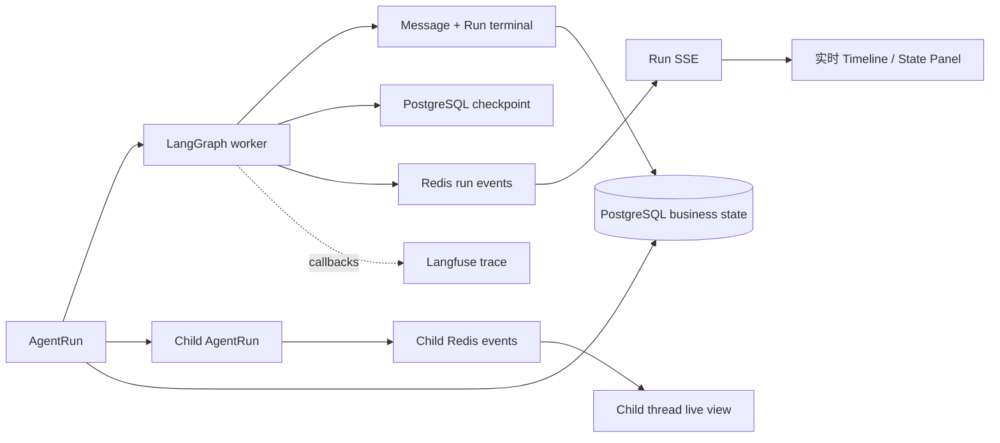

# 可观测性：实时过程、可恢复状态和调用链

Yuxi 用四类数据解释一次 AgentRun：PostgreSQL 保存请求、运行、消息和终态；PostgreSQL LangGraph checkpoint 保存可恢复的 Agent state；Redis Stream 与 SSE 投影实时过程；Langfuse 在启用时记录模型和工具调用链。四条链路围绕同一个 request、run 和 thread 工作，各自承担不同的事实责任。

## 整体链路

Request SSE 负责排队阶段。Ready 队头创建 Run 后，前端切换到 Run SSE。Worker 运行期间产生消息、工具、生命周期、审批、压缩和 Agent state 事件；结束后，页面重新读取 PostgreSQL 中的消息、Run 终态和 checkpoint 状态。

## 四个观察平面

| 平面 | 保存或投影的内容 | 适合回答的问题 |
| --- | --- | --- |
| PostgreSQL 业务状态 | Request、Run、Attempt、Message、ToolCall、lease、output 绑定和终态 | 请求是否被接收、由谁执行、结果属于哪个 Run、最终是否成功 |
| PostgreSQL checkpoint | messages 视图、todos、files、artifacts、subagent 摘要和 token usage | 页面断线后怎样恢复当前 Agent state |
| Redis Stream + SSE | loading、message、tool、interrupt、state、error、end 等短期事件 | 当前运行到了哪里、页面怎样实时更新 |
| Langfuse | 模型、工具、链路、延迟和 token trace | 一次模型或工具调用为何变慢、调用顺序和输入输出怎样关联 |

Redis 事件帮助用户理解进度。PostgreSQL 负责恢复和业务裁决。Langfuse 是可选观测能力，初始化或刷新失败不会阻断主执行。

## 实时 Agent state

LangGraph 产生 state 更新时，`chat_service` 提取并发送 `agent_state` chunk。前端当前使用的状态包括：

- `todos`，最多展示前 20 项；
- `files`；
- `artifacts`；
- `subagent_runs`；
- 当前 Run 的 `token_usage`。

运行中，相同状态签名不会重复推送。运行结束后，服务重新读取 checkpoint 并补发最终 state。页面断线恢复也从 checkpoint 读取，因此最终状态不依赖 Redis 中最后一条事件是否仍然存在。

## 子智能体的实时活动

子智能体使用独立 Child AgentRun、child thread、checkpoint 和 Redis Stream。父状态中的 `subagent_runs` 用于展示最近一次工具交互形成的状态摘要；它不持续镜像 Child Run 的每个数据库变化。

用户打开子线程后，页面读取 Child AgentRun，并直接订阅该 Run 的 SSE。完整的实时消息、工具活动和结束状态来自 Child Run 自己的事件链。父 Agent 继续通过父子线程关系读取状态和结果，文件协作仍发生在共享的 Project Workdir。

## Langfuse 与 Run 的关联

Chat 和 resume 执行开始时，服务创建 Langfuse callback、metadata 和 tags，并把它们传给 LangGraph。trace ID 由 request identity 稳定生成，最终写入同一 Run 绑定的输出 Message metadata。调试面板先通过 `AgentRun.output_message_id` 找到该输出，再解析 Langfuse 跳转地址。

Run 在产生输出 Message 前失败时，页面可能没有可用的 trace 跳转。反馈先写入 PostgreSQL，再尽力同步到 Langfuse。Langfuse trace 不决定 Run 是否成功，也不决定输出属于哪个 request 或 thread。

## 断线、缺失事件和恢复

- 浏览器通过 `Last-Event-ID` 继续读取 Run SSE。
- Redis 缺少最终 `end` 时，SSE service 会在 PostgreSQL 已进入终态后合成结束事件。
- Redis 事件过期后，消息历史、Run 状态和 Agent state 仍可从 PostgreSQL 回读。
- 子线程的实时视图订阅 Child Run；父状态摘要出现滞后时，以 Child AgentRun 当前状态为准。
- Langfuse 不可用时，页面保留本地 Run、Message 和 state，调试入口显示 trace 不可用。

## 源码定位与验证

- [AgentRun service 与 Run SSE](https://github.com/xerrors/Yuxi/blob/main/backend/package/yuxi/services/agent_run_service.py)
- [Chat service 与 Agent state 投影](https://github.com/xerrors/Yuxi/blob/main/backend/package/yuxi/services/chat_service.py)
- [Langfuse service](https://github.com/xerrors/Yuxi/blob/main/backend/package/yuxi/services/langfuse_service.py)
- [Agent 事件转换](https://github.com/xerrors/Yuxi/blob/main/backend/package/yuxi/agents/base.py)
- [SubAgent Run service](https://github.com/xerrors/Yuxi/blob/main/backend/package/yuxi/services/subagent_run_service.py)
- [前端运行事件处理](https://github.com/xerrors/Yuxi/blob/main/web/src/composables/useAgentStreamHandler.js)
- [子线程实时视图](https://github.com/xerrors/Yuxi/blob/main/web/src/components/SubagentThreadView.vue)
- [Langfuse 配置与反馈](../advanced/langfuse-integration.md)
- [AgentRun 生命周期](./agent-run.md)

修改可观测链路时，至少验证 Request SSE 到 Run SSE 的切换、Redis 断线恢复、缺失 `end` 的 PostgreSQL 终态补偿、state 去重和终态补发、Child Run 独立 SSE、Langfuse 未配置时的降级，以及输出 Message 与 trace ID 的同 Run 绑定。
